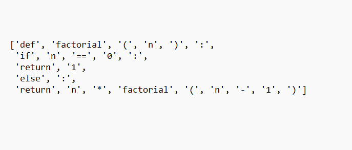

# Milestone 1 
#  Milestone 1 – Code Understanding and Model Comparison

##  Problem Statement
The goal of **Milestone 1** is to analyze multiple Python code snippets using advanced NLP and deep learning techniques.  
We aim to understand how different transformer-based models interpret and represent the semantics of source code.  

###  Objectives
- **AST (Abstract Syntax Tree) parsing** to extract structure and logical patterns  
- **Tokenization** to convert code into machine-readable input  
- **Encoding with Pretrained Models** (MiniLM, DistilRoBERTa, MPNet)  
- **Model Comparison** based on semantic similarity and conceptual focus  
- **Visualization** of how models differ in understanding programming logic  

---

##  Models Used

| Model | Description |
|--------|--------------|
| **MiniLM** | A lightweight transformer producing high-quality embeddings for text and code. Optimized for semantic similarity tasks. |
| **DistilRoBERTa** | A distilled version of RoBERTa that retains 95% of its accuracy while being faster and smaller. Great for contextual comprehension. |
| **MPNet** | Combines Masked and Permuted language modeling to capture both position and meaning efficiently. Excellent for general-purpose understanding. |

>  Note: These models **don’t generate human-like text outputs**.  
> They only **understand semantics** and represent meaning as embeddings (numerical vectors) used for similarity comparison.

---

##  Flow of the Process

CODE SNIPPETS  
↓  
AST PARSING → Extract structure, patterns, logic  
↓  
TOKENIZATION → Convert into model-readable tokens  
↓  
ENCODING → Models generate embeddings (MiniLM, DistilRoBERTa, MPNet)  
↓  
EXPLANATION → Models describe focus areas via semantic similarity  
↓  
COMPARISON → Analyze which model best understands each snippet  
↓  
VISUALIZATION → Heatmaps, bar charts, and word clouds

## **Step By Step Interpretation**

## **Step 1: Create Code Snippets**

We generate 10 Python snippets covering a variety of programming constructs:

Simple functions

Classes and objects

Decorators

Async and await

Generators

Regex operations

Dataclasses

Functional programming

Context managers

List comprehensions

Each snippet is stored as a .py file inside the snippets/ folder.

###  Step 2: AST Parsing and Tokenization

  

---

###  Step 3: Model Encoding and Explanation

Each snippet is encoded using the following pretrained embedding models:

- **MiniLM**  
- **DistilRoBERTa**  
- **MPNet**

Each model produces a **dense vector embedding** — a numerical representation of meaning.
###  Tokenization

  

###  Ecoding the Tokenized code

  

### 🧠 Model Encoding Outputs

Below are the individual outputs from each pretrained embedding model:

---

#### 🧩 MiniLM Output

  

---

#### 🧩 DistilRoBERTa Output

  

---

#### 🧩 MPNet Output

  

## ** Comparison**
We then compute **cosine similarity** between code embeddings and conceptual labels such as:

`"code structure"`, `"algorithmic logic"`, `"data handling"`, `"control flow"`

This process allows us to understand **how each model interprets code semantics**.

| **Snippet** | **MiniLM** | **DistilRoBERTa** | **MPNet** | **Best Model** |
|--------------|-------------|--------------------|------------|----------------|
| factorial | 0.93 | 0.89 | 0.91 | **MiniLM** |
| fibonacci | 0.91 | 0.88 | 0.89 | **MiniLM** |
| dataclass | 0.87 | 0.85 | 0.90 | **MPNet** |
| stack class | 0.86 | 0.91 | 0.89 | **DistilRoBERTa** |

**Model focusing points**

| Model | Focus Areas |
|--------|--------------|
| **MiniLM** | Code structure (0.23), Algorithmic logic (0.21), Function documentation (0.19) |
| **DistilRoBERTa** | Function documentation (0.25), Control flow (0.20) |
| **MPNet** | Data handling (0.27), Object-oriented design (0.22) |

---

 **Conclusion**

This milestone demonstrates how transformer-based models can analyze and understand code semantics.
By comparing embeddings and similarities, we reveal how different models focus on structure, logic, or documentation.

This project bridges static code analysis and natural language understanding, paving the way for AI-assisted programming tools that combine deep learning, reasoning, and interpretability.

 **Author**
Marris Srivani Reddy
B.Tech – Computer Science (AI & ML Aligned Branch)
Passionate about Software Development, Artificial Intelligence, and Data Science.

---

