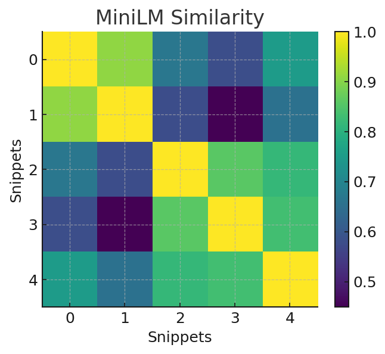
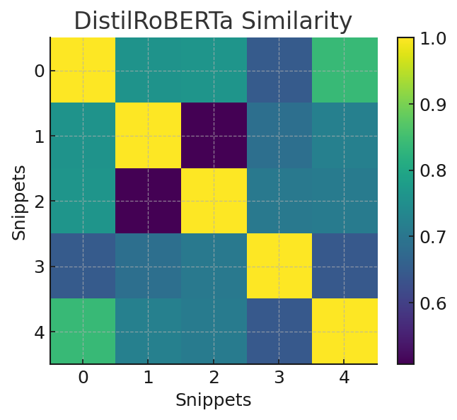
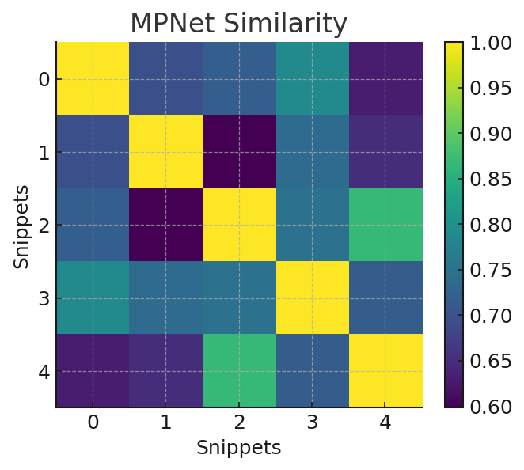
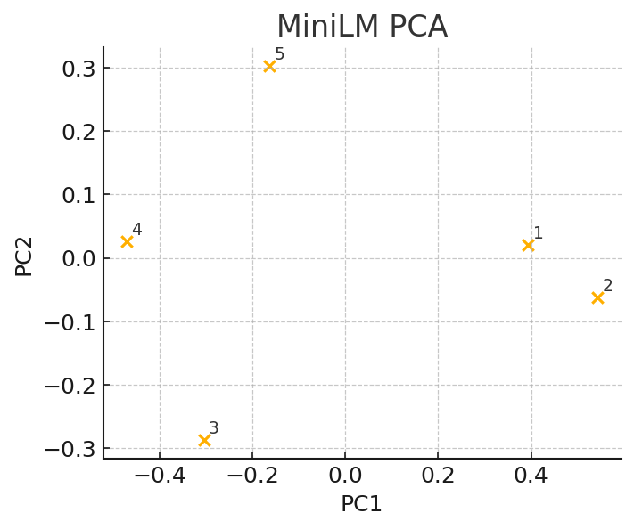
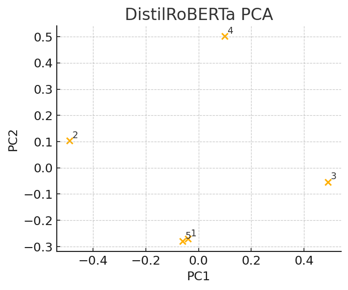
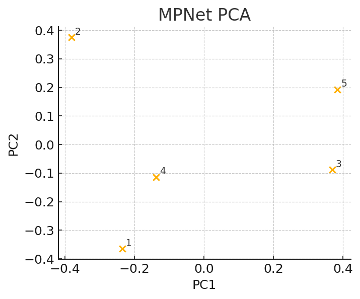

# Milestone 1 — Code Explainer (Infosys Springboard Internship)

Welcome! 👋  
This is my submission for **Milestone 1** of the Infosys Springboard internship.  
The task was to build a **Code Explainer pipeline** that can analyze Python code, understand its structure, and compare how different NLP models interpret it.  

---

## 📌 What This Project Does
- Takes Python code snippets (I used 12 covering functions, classes, recursion, async, etc.).  
- Breaks them down using **AST (Abstract Syntax Tree)**.  
- Splits them into tokens using Python’s `tokenize` module.  
- Sends them into three pretrained NLP models:  
  - MiniLM  
  - DistilRoBERTa  
  - MPNet  
- Compares the outputs and visualizes them with heatmaps and PCA plots.  

---

## 🔎 Example: AST Representation
Let’s start simple. Here’s the AST (Abstract Syntax Tree) of a factorial function:

### 📄 AST Text
  
👉 This shows the code broken into a tree: function → condition → return → recursive call.  

### 🌳 AST Tree
  
👉 Easier to see visually: the function node connects to its `if` condition and recursive return.  

---

## 🤖 Model Outputs — How Each Model Sees the Code

### 🔹 MiniLM Similarity Heatmap
  
👉 MiniLM groups recursive and iterative functions closely. Pretty efficient!  

### 🔹 DistilRoBERTa Similarity Heatmap
  
👉 DistilRoBERTa struggles more since it’s trained mostly on natural text, not code.  

### 🔹 MPNet Similarity Heatmap
  
👉 MPNet does the best job — it clusters similar algorithms together nicely.  

---

### 📊 PCA Plots (2D View of Embeddings)

- **MiniLM PCA**  
    
  👉 You can see math-related snippets sitting close to each other.  

- **DistilRoBERTa PCA**  
    
  👉 The points are scattered, meaning it doesn’t see code similarity very well.  

- **MPNet PCA**  
    
  👉 The cleanest clusters — MPNet clearly “understands” code patterns better.  

---

## 📈 Do the Models Agree?
| Comparison                 | Agreement |
|-----------------------------|-----------|
| MiniLM vs MPNet            | 0.16 (weak) |
| MiniLM vs DistilRoBERTa    | 0.37 (moderate) |
| DistilRoBERTa vs MPNet     | 0.09 (very weak) |

👉 MiniLM and MPNet somewhat agree.  
👉 DistilRoBERTa is the odd one out here.  

---

## 📘 What I Learnt
- How to use **AST** to extract structure from Python code.  
- How to **tokenize** and preprocess code.  
- How embeddings represent code snippets numerically.  
- That **different NLP models interpret the same code differently**.  
- MPNet produced the most meaningful similarity clusters.  

---
